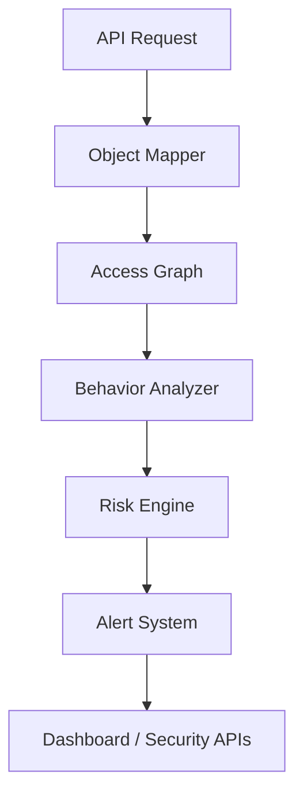

# API-Sentinel

API-Sentinel is an API runtime security platform for detecting BOLA, shadow APIs, zombie APIs, API abuse, suspicious clients, and behavioral anomalies.

## Current Backend Module

The first delivery focuses on the backend platform core:

- FastAPI application factory and router layout
- SQLAlchemy models on SQLite with PostgreSQL-ready configuration
- JWT authentication and RBAC dependencies
- Request logging middleware with persistent SQLite storage
- Enterprise BOLA heuristics engine with access graph learning and alert persistence
- API inventory, alerting, and detector modules
- Seeded mock users, orders, and admin roles for realistic testing

## BOLA Detection Architecture



The BOLA engine now learns from historical API traffic, records normalized observations, builds a user-object graph with NetworkX, and writes critical detections to both the dedicated `bola_alerts` table and the existing alert pipeline for dashboard visibility.

Security endpoints:

- `GET /api/security/bola-alerts`
- `GET /api/security/user/{id}/access-map`

## Run

```bash
uvicorn backend.app:app --reload
```

## Authentication Demo Accounts

- `alice / password123` - user
- `bob / secret456` - user
- `nina / analyst789` - security_analyst
- `devon / devpass321` - developer
- `viewer / viewonly555` - viewer
- `admin / Admin@9999` - admin

### BOLA simulation

The test suite now includes an attack simulation that exercises a normal read, then a cross-user object read, and verifies the resulting `Critical` BOLA alert.

## Next Modules

Frontend dashboard, analytics, and production deployment artifacts will be added after this backend module is confirmed.
